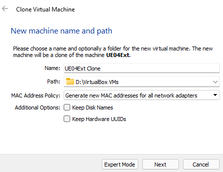
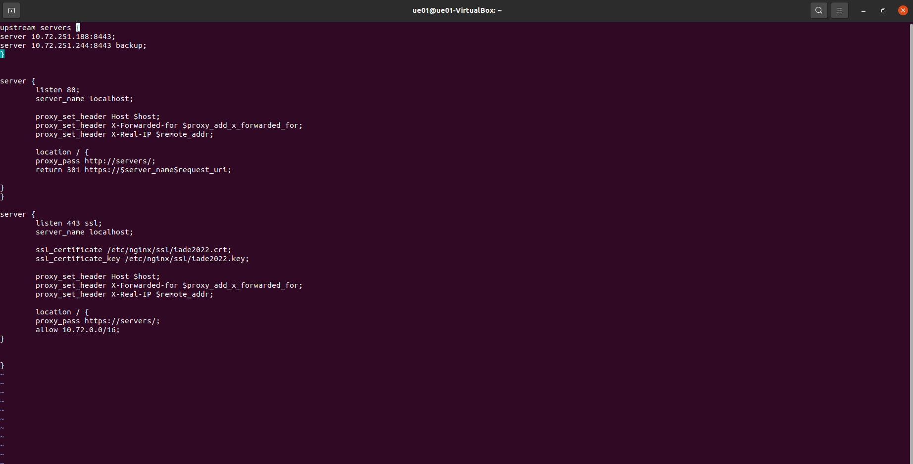

# Sistema de Anti-Ransomware Distribuido
## _Projeto desenvolvido por, Tomás Ferreira N20190881, João Rolo N20190861, Martim Costa N50039055_

_Documentation for project developed in the Distributed Systems Class_

In this documentation, it will be explained how you can replicate the system developed for the project, including commands for installing the necessary packages as well as  commands for configuring the files necessary to run the project.

For this project we will use the following set-up,
### Machines
| VM | Purpose | Necessary Packages | OS | Ram | DiskSpace| 
| :---: | :---:| :---:| :----:|:---:|:---:|
| **UE01, UE02** | Run the secure server service, this machines will be the core of the system, since they will be the ones using the client server API, saving security copies, File Hashes, and re-uploading to the client server| Golang-1.16>= | Ubuntu 20.04 | It's prefered to use 2gb of ram during the instalation, but later you can downgrade it to 1gb of ram, since its enough to run the necessary application | Minimum 10gb |
| **UE03** | Run the client server service, which will contain the client files, that are going to be saved in the secure server, aswell as their hash | Golang-1.16>= | Ubuntu 20.04 | It's prefered to use 2gb of ram during the instalation, but later you can downgrade it to 1gb of ram, since its enough to run the necessary application | Minimum 10gb |
| **UE04** | Run the Nginx service, using the Nginx Load-Balancer service | Nginx1.18>= | Ubuntu 20.04 | It's prefered to use 2gb of ram during the instalation, but later you can downgrade it to 1gb of ram, since its enough to run the necessary application | Minimum 10gb |

After installing a the Ubuntu ISO file, you can create a VM in the virtualization software of your choice, with the settings referred above. You only need to do this once, since you can create linked clones from the first Vm created.


On 2 of the machines, you will need to install the Golang and git package, and to do so, just run:
```
sudo apt install golang git
```

This will install the latest version of the Go programming language version, ad the latest version of git.
After installing the Golang, you will need to clone the repository of the project, using:
```
git clone https://github.com/tolojo/Anti-Ransomware-SD
```

After cloning the repository, you will need to go inside the cloned repository directory with the following command:
```
cd Anti-Ransomware-SD/src
```

On UE01, you will change the "ipServerPub" string to the ip of UE03 VM and "ipServerSecure" to the UE02 ip;
On UE02, you will change the "ipServerPub" string to the ip of UE03 VM, and comment the ipServerSecure since this machine will be the backup of UE01 and comment this piece of code:
```
requestBody, err := json.Marshal(map[string]string{"name": data.fileName})
		serverResp, err := http.Post(ipServerSecure+"/save", "application/json", bytes2.NewBuffer(requestBody))
		if err != nil {
			log.Print(err)
		}
		log.Print(serverResp)
```

Note: If you don't comment this piece of code, most likely, the machine will be stuck in a loop;
To run the project, just run:
```
go run main.go
```

And done, you have the machines UE01 and UE02 properly set-up;

For UE03, you will need to do the same commands as to install the necessary packages and clone the repository, but instead of going to the "/Anti-Ransomware-SD/src", you will go the "/Anti-Ransomware-SD/src_ue04" directory and run the same command to run the project, you dont need to change a thing in this folder;

As for UE04, you will need to install the Nginx package with the following command:
```
sudo apt install nginx
```

With Nginx properly installed, you will need to go inside the directory of the configuration files and create a new file using the following command:
```
sudo vim /etc/nginx/conf.d/example.conf
```

And write the file like this:



And change the IP's on the upstream servers to match the UE01 and UE02 IP's
To create the key and certificate to run the server on https, just create a directory on nginx using this command:
```
sudo mkdir /etc/nginx/ssl
```

And run the command to generate the key and certificate:
```
sudo openssl req -x509 -nodes -days 365 -newkey rsa:2048 -keyout /etc/nginx/ssl/sdiade2022.key -out /etc/nginx/ssl/sdiade2022.crt
```

Run "sudo nginx -t" to test if the file is correctly set-up and run the following command to restart the nginx service:
```
sudo service nginx restart
```
 
If everything went right you should see the go application template HTML pop-up when u type the UE04 machine IP on the browser.
